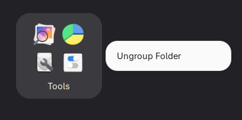
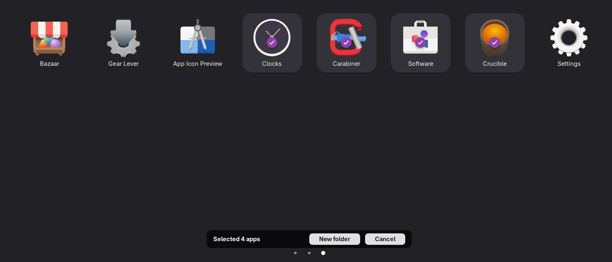

# App Folder Management

[](https://extensions.gnome.org)

Adds easy app folder management directly from the GNOME Shell app grid.

## Features

- **Ungroup folders** — Right-click any folder in the app grid to ungroup it.
- **Create folders** — Right-click empty grid space, select apps, then group them into a new folder.

## Screenshots





## Installation

### From extensions.gnome.org (recommended)

Visit [extensions.gnome.org](https://extensions.gnome.org) and enable the extension.

### From source

```sh
git clone https://github.com/sugarycandybar/gnome-shell-extension-app-folder-management.git \
  ~/.local/share/gnome-shell/extensions/app-folder-management@sugarycandybar.github.io
```

Then enable the extension using [GNOME Extensions](https://gitlab.gnome.org/GNOME/gnome-shell/-/tree/main/subprojects/extensions-app) or:

```sh
gnome-extensions enable app-folder-management@sugarycandybar.github.io
```

## Compatibility

- GNOME Shell 45 – 50

## License

GPL-3.0-or-later
